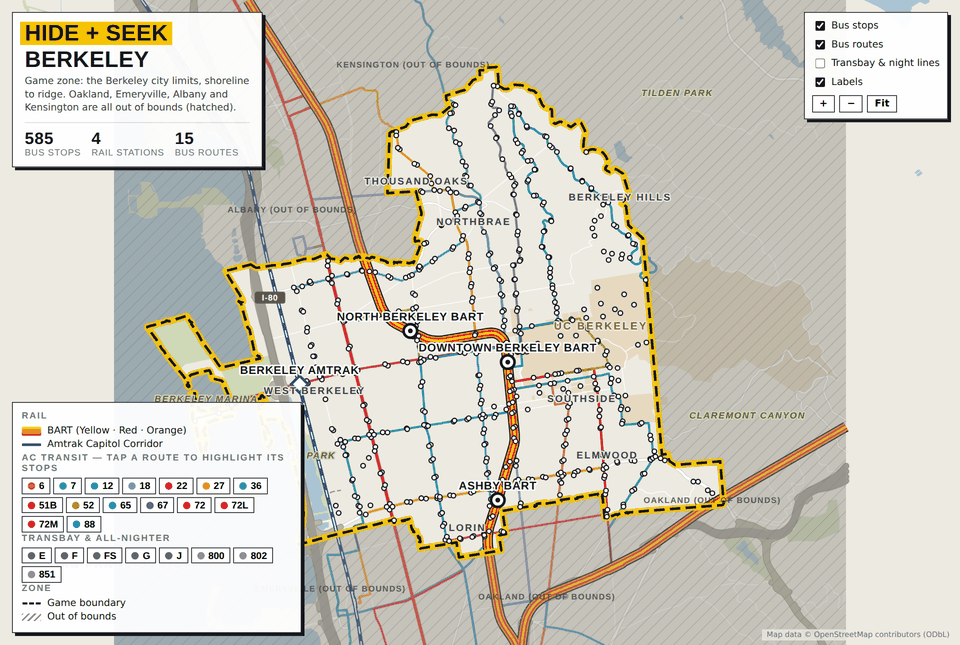

# Jet Lag: Hide + Seek — Berkeley

Maps and a phone companion for playing [Jet Lag: The Game](https://jetlagthegame.com/)'s
Hide + Seek in Berkeley and North Oakland, built from OpenStreetMap data.

There are two maps and one companion app. The maps show every bus stop and
rail station inside the game zone, drawn in the show's visual language —
dashed boundary, hatched out-of-bounds, one colour per bus line. The
companion is what the players actually hold during a round: seekers send
questions through it, the hider answers, and everything syncs across
phones. Neither tool works out where the hider is. That part is the game.



## The maps

`maps/berkeley.html` is the Berkeley city limits, shoreline to the Tilden
ridge: 585 bus stops, four rail stations, fifteen AC Transit lines. It fits
a small game — a 30-minute hiding period and a 500 m hiding zone.

`maps/berkeley-north-oakland.html` adds Oakland north of Highway 24: 714
stops, six stations. Bigger, and it brings Rockridge and MacArthur BART
into play.

With GitHub Pages turned on they are served as a live site, which is the
easy way to open one on a phone mid-game.

Both are single self-contained HTML files. Open one in a browser and it
works offline from then on, which matters when you are on a platform with
one bar of signal. Drag to pan, pinch or scroll to zoom, hover or tap a
stop for its name and routes, and tap a route chip in the legend to
highlight just that line and the stops it serves. Zoom past about three
times the framing view and the minor street network fades in, so a stop
stops being a dot in space and becomes a corner you can walk to; zoomed
out it stays off, where it would only grey the map over.

### Where the boundary comes from

Berkeley's zone is the city limits, trimmed at the shoreline — the legal
boundary runs out into the bay, and a line drawn across open water is a
line nobody can walk.

"Oakland north of Highway 24" needed more care, because that is not a line
OpenStreetMap hands you. CA-24 is mapped as one way per carriageway with
gaps at every interchange, so the pieces get unioned and buffered into a
single ribbon before they can cut anything. The bigger problem is that
CA-24 ends at the I-580/I-980 interchange, about a mile short of the
Oakland city line: cut there and the boundary leaks, and the "northern"
piece comes back as the entire city. The cut therefore continues west along
I-580 to the Emeryville line, with a short connector closing the gap at the
interchange. That whole line is drawn on the map as a faint band under the
boundary so you can see what the rule actually means on the ground.

Rockridge and MacArthur BART sit in the freeway median right on that
boundary. They are drawn and marked `(edge)` rather than quietly included
or excluded — whether they count is a house rule, not something a map
should decide for you.

## The companion

`companion/index.html` is a phone app for running a round, served straight
from the site. Everyone opens it, picks a name and a role, and creates or
joins a game with a four-letter code — nothing to install and nothing to
sign in to.

Seekers pick from the real question deck — Matching, Measuring, Radar,
Thermometer, Photo, and Tentacles in medium and large games — and send a
question. It lands in the hider's inbox with the draw-and-keep count for
that category. The hider taps Yes/No, Closer/Further, Hotter/Colder, takes
a photo straight from the camera, or vetoes. The answer flows back to a
shared feed on every phone. The hider logs the cards they keep and can send
curses and notes. The status card runs the hiding-period countdown and the
hider's clock, and finished rounds land on a scoreboard.

The hider's hand is private — seekers see neither the cards nor how many
there are. They find out when something gets played.

Radars, measuring and thermometers record where the seeker was standing,
because the answer means nothing without it. Tentacles offer the hider the
places of that type actually within range of where the seeker asked, plus
"not within reach" — which is a valid answer under the rules, and a strong
one, because it rules out the whole circle. Thermometers follow the real
two-leg procedure rather than being a single tap: starting one sends the
hider your position immediately, you travel, and only once the app confirms
you have covered the distance as the crow flies does the question actually
go out, carrying both endpoints.

Photo answers go through the same sync as everything else. The camera
produces a file far too big for a public broker, so the photo is re-encoded
in the browser — 1280 px on its long side, quality stepped down until it
fits about 110 KB — and sent as its own document, which both public brokers
accept and retain. Opened as a claude.ai artifact it uses the real asset
store instead and skips the re-encoding. Either way the seekers see the
photo in the feed, and "describe instead" is there for when the shot is
impossible.

Question text, category draw counts, hiding periods, zone radii and photo
time limits follow the published Hide + Seek rules; the size of the game
switches which cards are available.

A Map tab carries both game zones — every stop, the boundary, the street
network, your own location from GPS, and a quarter-mile hiding-zone circle
the hider can drop on whichever stop they picked. Anyone can drop a labelled
pin, which syncs to everyone.

### What the answers rule out

Answers narrow the map, for seekers and hider alike, and every phone narrows
it the same way. What greys out is the ground, not the stations: the hider
has to be inside a hiding zone around one of the stations still in play, so
everything outside those zones is shaded over, leaving the area still worth
searching. A counter says how many stations are left, a Zones control
outlines each surviving zone separately, and tapping a stop lets you rule it
out by hand for the deductions the app cannot make.

The rulebook decides how much an answer rules out, and it is explicit:
*"radars are asking about your location, not your hiding zone. If the radar
would encompass part of your hiding zone, but not your location at the time
of answering, it would be a miss."* The hider may also move freely anywhere
in their zone until the end game. So a station falls only when **no point at
all** of its zone could have produced the answer — which is why a 500 m radar
answered "no" rules out almost nothing, and that is correct. A **Station**
setting on the Game tab reads answers against the station instead, ruling out
everything inside that circle; it is sharper, it is how people tend to play,
and it is a house rule, so it says so.

The geometry is exact, not bounded. Each answer becomes the region of points
that could have produced it — a disc for a radar, a half-plane for a
thermometer, a union of discs for a measuring card, a Voronoi cell for a
matching or tentacle card, a city outline for an administrative one. An exact
distance transform turns the region into a distance field, and the station
survives if the field at the station is within its zone radius. The grid is
25 m, so it is exact to about half a cell.

Reference features are whatever falls inside the game map, because the
rulebook says so: *"if locations are not within a map's boundaries, players
must operate as if they do not exist"*, and the question comes back **null** —
it still counts, the hider still draws, and it tells the seekers nothing. In
the Berkeley zone that means commercial airports, zoos, aquariums, amusement
parks, golf courses and consulates are all null, and the app marks them in
the question list before you spend one. Museums, libraries, hospitals,
cinemas, mountains, parks, named water and rail stations are live. Parks and
bodies of water are measured to their map icon, as their cards say; the
coastline is measured to itself.

The cards it leaves alone, and says so in the feed: transit line, street or
path, landmass, high-speed train line, international border, sea level, and
the state and county divisions — the county line runs right along the
Berkeley ridge and would be a good constraint, but the boundary data is not
in the extract yet.

Sizes follow the metric edition: a 500 m hiding zone for small and medium
games, 1 km for large, hiding periods of 30, 60 and 180 minutes, and the
metric radar and thermometer distances.

### How the phones stay in sync

All the companion needs from a backend is a handful of small JSON documents
every phone can see. Three implementations sit behind one doc/collection
API, tried in order:

The **claude.ai artifact runtime** (`claude.use("db")`), when the page is
opened as an artifact. Private to one account and properly durable.

A **public MQTT broker** over WebSockets otherwise — EMQX, falling back to
HiveMQ. Each document is one retained message under `jlhs/v1/…`, so a phone
that joins late gets the current state the moment it subscribes, and
deleting a document means publishing an empty retained payload. This is what
makes the hosted copy work with nothing to sign up for. The trade is real
and the app says so on its lobby screen: the broker is public, so the
four-letter game code is the only thing keeping a stranger out, and delivery
is best-effort.

**Local storage**, if neither is reachable. One device only — no sync — but
the timers, cards, rules and map still work.

Swapping in Firebase, Supabase or your own server means writing one more
`io` object in `tools/companion_template.html`: `publish`, `watchDoc`,
`watchCollection`, `attach` and `settle`. The data model is four
collections: `games/{code}` and its `questions`, `messages` and `pins`.

## Building

The repository ships the OSM extract it was built from, so a build needs no
network:

```
pip install shapely
python3 tools/make_zone.py        # boundary polygons -> data/zone.json
python3 tools/build_map.py --all  # the two map pages
python3 tools/build_companion.py  # the companion, with both maps baked in
```

To refresh against current OpenStreetMap data:

```
python3 tools/fetch_osm.py      # re-runs the Overpass queries
```

Overpass is a shared public service; the fetch script pauses between
queries and backs off on rate limits. The queries themselves are in
`tools/overpass/`, readable on their own if you want to adapt this to
another city. The minor street network is fetched over a tighter bounding
box than the rest: at that density the whole basemap extent is not worth
the file size, and outside the game zone nobody reads it.

### Putting it online

The maps are static files, so GitHub Pages serves them as-is: in the
repository settings, under Pages, deploy from the `main` branch at the
repository root. GitHub then shows you the site's address; the landing page
is at the root, the maps under `/maps/` and the companion under
`/companion/`. All of it is static — there is no server to run.

```
index.html     landing page, for GitHub Pages
maps/          the two built map pages
companion/     the phone app
tools/         fetch, zone and build scripts, plus the page templates
  overpass/    the OSM queries, one file each
data/          the OSM extract and the computed zone polygons
screenshots/   images used by this README
```

`build_map.py` projects to Web Mercator with the origin at the zone
centroid, writes each layer as one SVG path using relative `lineto`
commands, and simplifies geometry to roughly three metres — together that
gets a whole city's street network, 700-odd stops and thirty bus routes
into a 300 KB file that pans smoothly on a phone.

Adapting this to another city is mostly a matter of the bounding boxes in
`tools/overpass/`, the city names in query 01, and the route colours and
hand-placed labels at the top of `tools/build_map.py`. The zone logic in
`make_zone.py` is specific to cutting a city along a freeway; if your zone
is just a city limit, you can delete most of it.

## Credits and licence

Map data © OpenStreetMap contributors, available under the
[Open Database License](https://www.openstreetmap.org/copyright). Transit
data is whatever OSM has for AC Transit, BART and Amtrak, which is good but
not authoritative — check a stop against AC Transit before betting a round
on it.

Hide + Seek is a game by [Jet Lag: The Game](https://jetlagthegame.com/).
This is an unofficial fan-made tool, not affiliated with or endorsed by
them; buy the home game from them, it's good.

The code here is MIT licensed. See [LICENSE](LICENSE).
